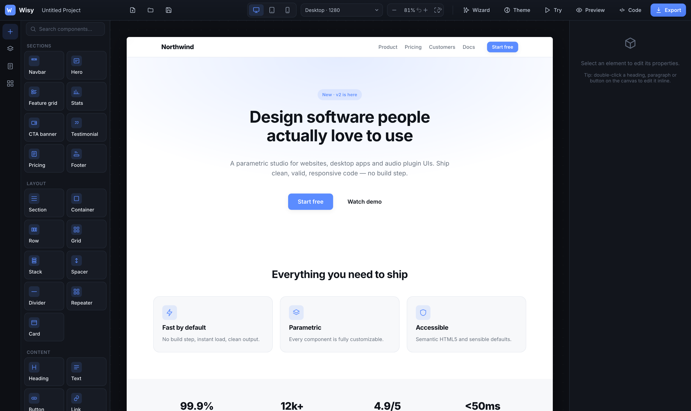
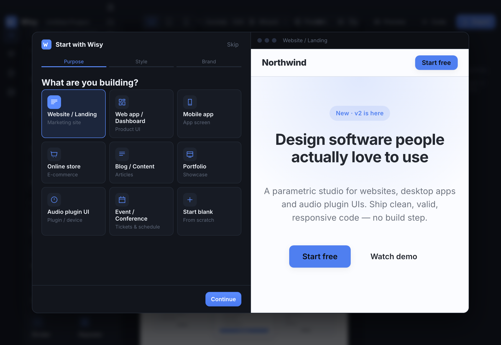
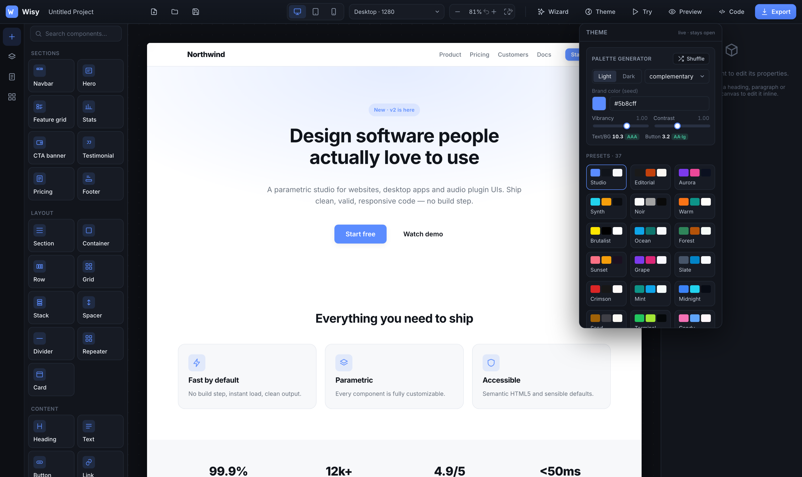
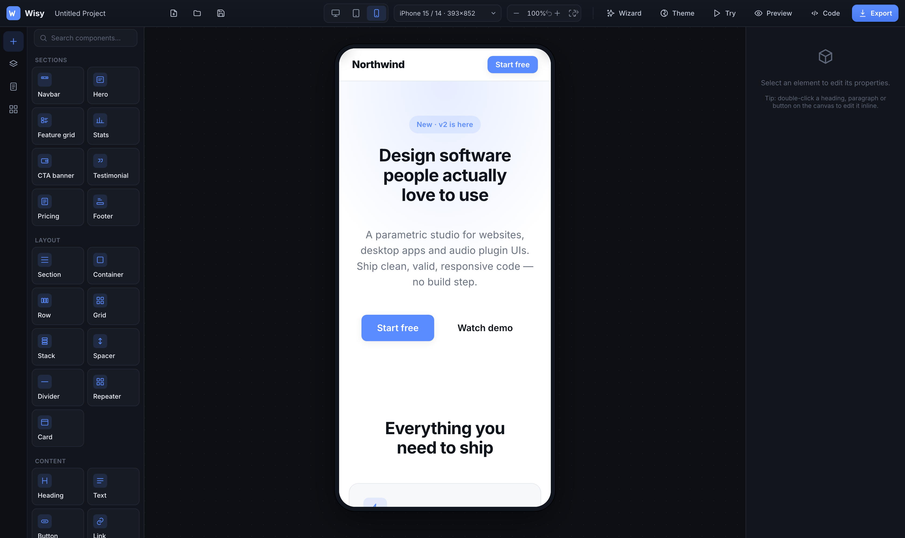
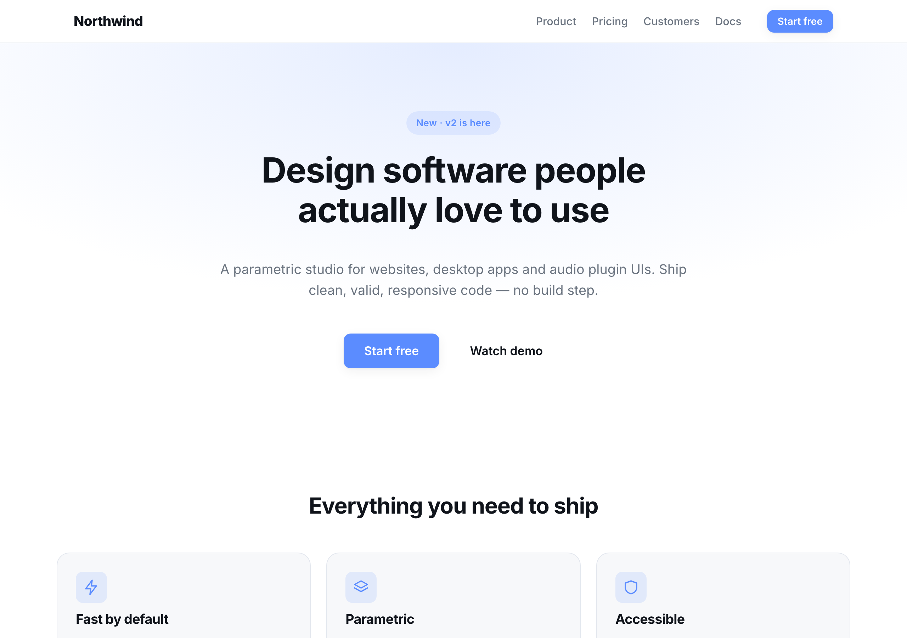
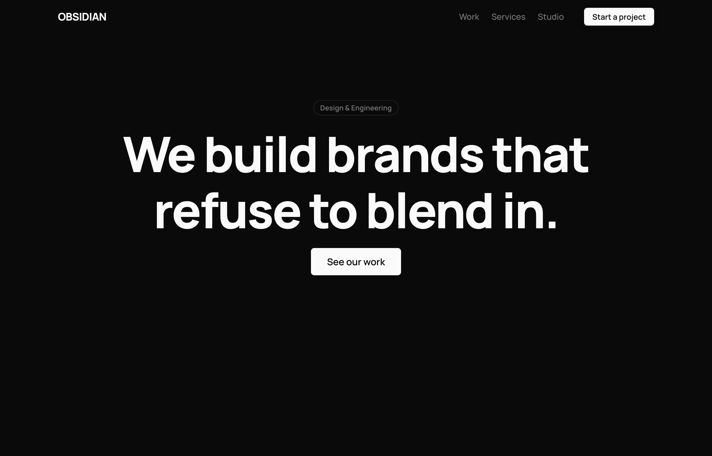
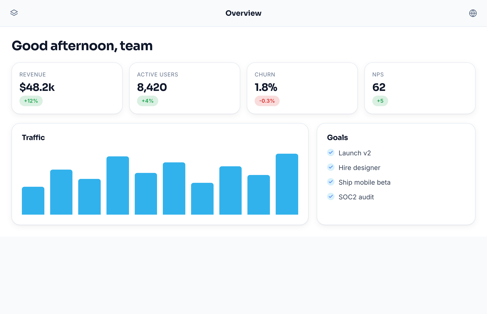
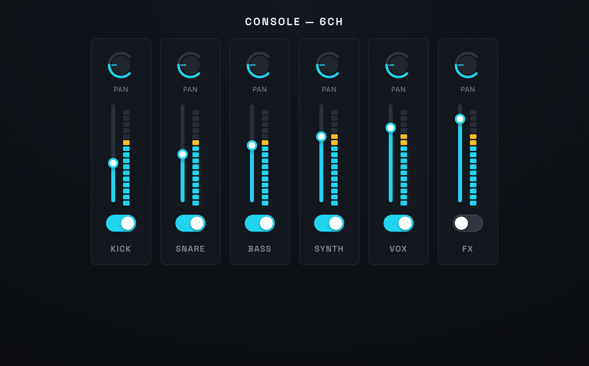
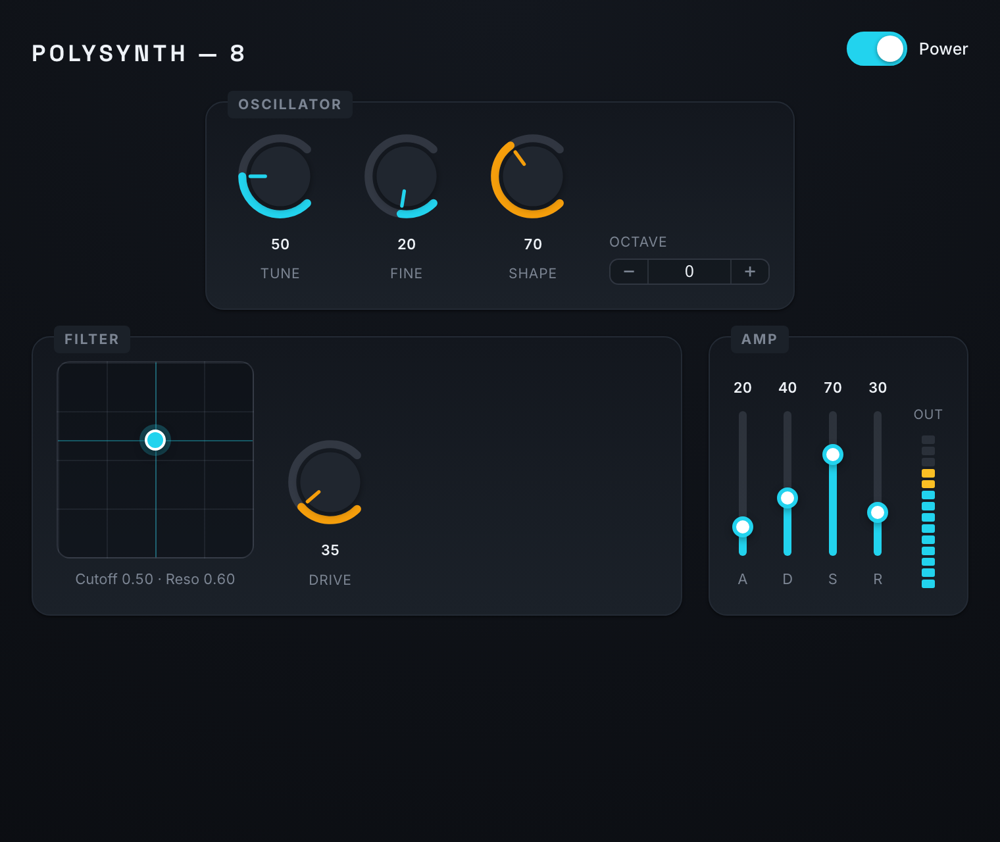
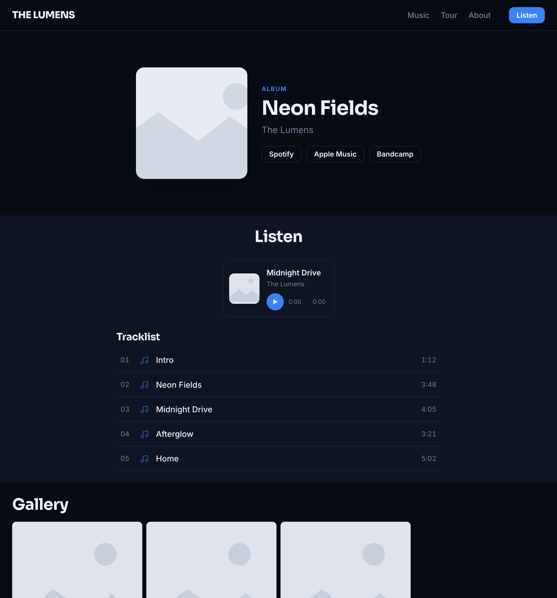

<div align="center">

# Wisy

**A parametric visual design studio for the web, desktop and audio software UIs.**

Design on a canvas. Export clean, valid, dependency-free HTML5, CSS and JavaScript.
No build step, no framework, no lock-in.

<br/>



</div>

<br/>

## Overview

Most visual builders produce bloated markup you can never own. Wisy is built on a single principle: the editor and the export share one renderer, so **what you see on the canvas is exactly what ships** — semantic HTML5, token-driven CSS, and a tiny zero-dependency runtime for the interactive elements.

It is not limited to marketing pages. The same engine builds dashboards, mobile screens, blogs, storefronts, and audio software front-ends, from a library of 56 parametric components and 32 ready-made templates.

<br/>

## Start in three steps

An optional setup wizard turns a purpose, a vibe and a brand color into a tailored starting point — with a live preview that updates as you choose. Skip it any time.



<br/>

## A real color system, not guesswork

Pick a brand color and Wisy builds a balanced, accessible palette in the OKLCH perceptual color space, with live WCAG contrast checks and color-wheel harmonies. Drag a slider and the entire design morphs in real time. Presets and the generator are independent: re-roll the colors while keeping a preset's typography.



<br/>

## Design for the device, at real size

Switch between exact device presets — iPhone, Pixel, Galaxy, iPad — at their true logical dimensions and aspect ratios, with constrained internal scrolling, 1:1 at 100% zoom. Or work fluidly across desktop, tablet and mobile breakpoints. A Try mode runs the page like the real thing: links, widgets, animations and scrolling all live.



<br/>

## Capabilities

| | |
|---|---|
| **56 parametric components** | Sections, layout primitives, content, general UI (alerts, avatars, breadcrumbs, steps, timeline, progress, accordion), media, data charts, music, forms and mobile bars — each with a library of named style presets. |
| **Data visualization** | Nine pure-SVG chart types (bar, line, area, pie, donut, sparkline, gauge, progress, radar), themed automatically. |
| **Audio-grade controls** | Knob, slider, XY pad, level meter, toggle, stepper and rack panel as real custom elements, drag and scroll interactive, shipped with your export. |
| **Pro editing** | Drag-to-insert and reorder, resize handles, inline rich text with a floating typography toolbar, structured list editors, slider and scrub-number controls, a graphical alignment pad, a visual gradient editor and a draggable image focus-point with crop. |
| **Assets, fonts and icons** | A graphical icon browser (263 icons), a font browser (110 Google fonts with pairings and live preview), and an image picker with upload, keyword stock search and cropping. |
| **Media embeds** | Paste a YouTube, Vimeo, Spotify, SoundCloud, Maps, Figma or CodePen link and get a responsive, privacy-respecting embed. |
| **Motion** | Entrance, hover, scroll-driven (parallax, fade, zoom, rotate) and on-click effects, with a scroll-reveal runtime bundled into the export. |
| **Themes** | 37 token-based themes spanning light and dark, serif and mono, sharp and rounded. |
| **Projects** | Multi-page documents, undo/redo, autosave, and save/open of portable `.wisy.json` project files to hand off to a colleague. |

<br/>

## Templates

Thirty-two starting points across marketing, app, e-commerce, industry, content, audio, mobile and utility — many shipping multiple core pages (Home, About, Pricing, Contact).

<table>
  <tr>
    <td width="50%"></td>
    <td width="50%"></td>
  </tr>
  <tr>
    <td width="50%"></td>
    <td width="50%"></td>
  </tr>
  <tr>
    <td width="50%"></td>
    <td width="50%"></td>
  </tr>
</table>

<br/>

## Quick start

No dependencies. Clone the repository and serve the folder:

```bash
git clone https://github.com/DatanoiseTV/wisy.git
cd wisy
python3 -m http.server 5173      # or: npx serve .
```

Open `http://localhost:5173`, follow the wizard or pick a template, design in the inspector, press **Try** to test it, and **Export** when it is ready.

<br/>

## Architecture

Plain ES modules, zero runtime dependencies. The renderer is shared between the editor and the export, which makes the canvas a faithful preview rather than an approximation.

| File | Responsibility |
|------|----------------|
| `src/state.js` | Document model, history and undo, pub/sub store, device presets |
| `src/registry.js` | Component definitions — schema plus a render to semantic HTML5 |
| `src/render.js` | Node-to-DOM renderer, base and component CSS, responsive and motion CSS |
| `src/widgets.js` · `src/charts.js` | Interactive custom elements and runtimes, bundled into exports |
| `src/canvas.js` | Iframe canvas, selection, drag and drop, resize, zoom, device frames, Try mode |
| `src/inspector.js` | Parametric property and style editor: lists, sliders, pickers, gradient, alignment |
| `src/color.js` | HSL and OKLCH math, WCAG contrast, the palette generator |
| `src/pickers.js` | Icon, font, link and asset pickers, and the crop modal |
| `src/wizard.js` · `src/theme-editor.js` · `src/templates.js` · `src/library.js` · `src/layers.js` · `src/pages.js` · `src/textbar.js` · `src/dialog.js` | Wizard, panels, toolbars and dialogs |
| `src/export.js` | HTML, CSS and JavaScript generation, ZIP packaging, preview, code view |

<br/>

## Exported output

```
your-site/
  index.html      one file per page
  styles.css      design tokens, components, widgets
  widgets.js      interactive UI elements and scroll-reveal runtime
  charts.js       chart custom element
```

Open `index.html` directly or serve it. No build, no install.

<br/>

## License

MIT. See [`LICENSE`](LICENSE).
