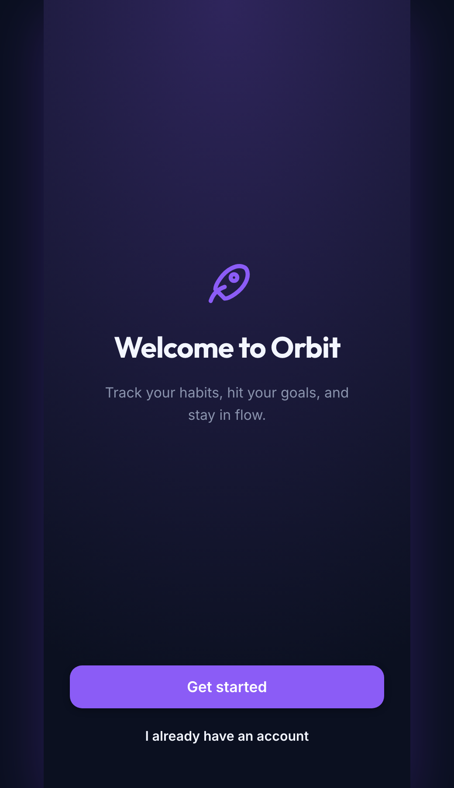

<div align="center">

# Wisy

### A parametric visual design studio for the web, desktop & audio software UIs

Design on a canvas. Export clean, valid, dependency‑free **HTML5 + CSS + JS**.
No build step, no framework, no lock‑in.


</div>

---

## Why Wisy

Most visual builders ship bloated, unreadable markup you can never own. Wisy is built around one rule: **what you see on the canvas is exactly what you export** — because the editor and the export share the same renderer. The output is semantic HTML5, token‑driven CSS, and a tiny zero‑dependency runtime for the interactive widgets.

And it isn't only for marketing pages. The same engine builds **dashboards, mobile app screens, and audio software front‑ends** (JUCE WebView, plugin UIs) — with first‑class **knobs, sliders, XY pads, level meters, toggles and steppers** as real custom elements.

## Highlights

- 🎛️ **Audio‑grade UI widgets** — knob, slider (H/V), XY pad, level meter, toggle, stepper, rack panel. Real `<wisy-*>` custom elements, drag/scroll/keyboard interactive, shipped with your export.
- 🧩 **Parametric components** — navbar, hero, feature grid, stats, pricing, testimonial, CTA, footer, forms, mobile app/tab bars, plus layout primitives — each fully customizable.
- 🎨 **Token‑based themes** — color, typography (curated Google‑font pairings, proper type scale & kerning), spacing, radius, shadow. 8 presets + a live theme editor. Re‑theme instantly.
- ✨ **Animations** — entrance (fade / zoom / rise / blur / flip, with direction, duration, delay, easing, scroll‑reveal or on‑load) and hover effects (lift / grow / sink / glow / tilt). Ships an `IntersectionObserver` runtime.
- 📐 **Real responsive** — the canvas renders in an iframe, so breakpoints behave exactly like the shipped site. Per‑breakpoint style overrides for desktop / tablet / mobile.
- 🗂️ **15 templates** across Marketing, App, Audio, Mobile & Utility.
- 🧰 **Pro editing** — drag‑to‑insert, drag‑to‑reorder, resize handles, inline text editing, layers tree, multi‑page projects, undo/redo, zoom (fit / in / out / ⌘‑wheel), autosave.
- 📦 **Clean export** — pretty‑printed valid HTML per page + shared `styles.css` + `widgets.js`, packaged as a ZIP. Live preview & syntax‑highlighted code viewer.

## Screenshots

<table>
  <tr>
    <td width="50%"><br/><sub><b>SaaS landing</b> — marketing</sub></td>
    <td width="50%"><br/><sub><b>Agency</b> — bold dark</sub></td>
  </tr>
  <tr>
    <td width="50%"><br/><sub><b>Dashboard</b> — app shell</sub></td>
    <td width="50%"><br/><sub><b>Mixer</b> — audio console</sub></td>
  </tr>
  <tr>
    <td width="50%"><br/><sub><b>Synth plugin</b> — knobs, XY pad, meters</sub></td>
    <td width="50%" align="center"><br/><sub><b>Mobile onboarding</b></sub></td>
  </tr>
</table>

## Quick start

No dependencies. Clone and serve the folder:

```bash
git clone https://github.com/DatanoiseTV/wisy.git
cd wisy
python3 -m http.server 5173      # or: npx serve .
# open http://localhost:5173
```

Then drag components from the left, pick a template, tweak in the inspector, and hit **Export**.

## Architecture

Plain ES modules, zero runtime dependencies. The renderer is shared between the editor and the export, so the canvas is a faithful preview.

| File | Responsibility |
|------|----------------|
| `src/state.js` | Document model, history/undo, pub‑sub store |
| `src/registry.js` | Component definitions (schema + render → semantic HTML5) |
| `src/render.js` | Node→DOM renderer, base component CSS, per‑node + responsive CSS, animation CSS |
| `src/widgets.js` | Self‑contained `<wisy-*>` custom elements + animation runtime (bundled into exports) |
| `src/canvas.js` | Iframe canvas, selection overlay, drag/drop, resize, zoom |
| `src/inspector.js` | Parametric property + style + animation editor |
| `src/library.js` · `layers.js` · `pages.js` · `templates.js` · `theme-editor.js` | Side panels |
| `src/export.js` | HTML/CSS/JS generation, ZIP, preview, code view |
| `src/dialog.js` | In‑app modal dialogs |

## Exported output

```
your-site/
├── index.html        # + one file per extra page
├── styles.css        # design tokens + components + widgets
└── widgets.js         # interactive UI elements + scroll-reveal runtime
```

Open `index.html` directly or serve it — no build, no install.

## Roadmap / known limitations

- Cross‑page navigation links aren’t auto‑rewired on export (anchors are `#`).
- Resize handles adjust width/height (flow layout); free absolute positioning is available via the inspector `position` control.
- Persistence is local (browser `localStorage`); no cloud/collaboration layer yet.

## License

MIT — see [`LICENSE`](LICENSE).
